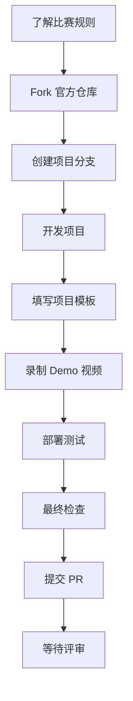

# LegionSpace Hackathon 操作流程指南

## 📋 总体流程概览



## 🚀 详细操作步骤

### 第一阶段：准备阶段（比赛开始前）

#### 1. 了解比赛规则
- [ ] 访问 LegionSpace 官方黑客松页面。
- [ ] 学习 MCP、ERC-8004、x402 的核心概念与官方文档。
- [ ] 了解评审标准：技术执行与完整性 35%、概念创新性 20%、技术创新性 20%、用户体验 15%、潜在影响力 10%
- [ ] 确认关键日期：报名、工作坊、最终提交截止日、Demo日。


#### 2. 奖金与奖励（Prizes）
    
    总奖金：60,000

    一等奖：20,000

    二等奖*2：10,000

    三等奖*3：5,000

    最佳创意：5,000

    “空间领航计划”：优秀作品将获得大群空间上架机会，并持续获得为期6个月的项目市场化辅导。
    

#### 3. Fork 官方仓库
```bash
# 访问官方仓库
https://github.com/LegionSpace-Hackathon/Hackathon6

# 点击 Fork 按钮创建自己的副本
# 或使用命令行
git clone https://github.com/LegionSpace-Hackathon/Hackathon6.git
cd Hackathon6
```

### 第二阶段：项目开发阶段

#### 4. 创建项目目录
```bash
# 在你的 Fork 仓库中创建项目目录
mkdir projects/[你的团队名]-[项目名]
cd projects/[你的团队名]-[项目名]
```

#### 5. 初始化项目

```bash
# 复制官方 README 模板到你的项目目录
cp ../../README.md ./README.md

# 开始填写项目信息
```

#### 6. 开发与实现
- [ ] 按照你的技术栈实现核心功能
- [ ] 设计和编写MCP服务（如需要）
- [ ] 开发前端界面（如需要）
- [ ] 实现后端服务（如需要）
- [ ] 编写测试用例

### 第三阶段：提交准备阶段

#### 7. 完善项目文档
请确保你的项目README包含以下部分：
- [ ] 项目名称与简介：一句话说清你的项目是什么。
- [ ] 赛道选择：明确说明你参与的是哪个赛道。
- [ ] 核心创新：如：描述你的项目如何突出地使用了MCP和区块链协议；描述你的智能体们是否有清晰的角色和协作机制；描述你的智能体的身份、记忆和成长机制；阐述你的智能体经济如何运行等
- [ ] 系统架构：提供清晰的架构图，展示智能体、MCP服务器、区块链之间的数据流与价值流。
- [ ] MCP服务说明（如有）：详细列出你使用或创建的MCP服务器及其功能。
- [ ] 安装与运行指南：清晰的步骤，让评审能快速复现你的项目。
- [ ] Demo视频链接。
- [ ] 团队介绍信息。


#### 8. 录制 Demo 视频
- [ ] 视频时长：≤ 3分钟
- [ ] 语言：中文
- [ ] 内容：展示核心功能与完整流程
- [ ] 获取分享链接

#### 9. 部署与测试
- [ ] 部署智能体和MCP服务
- [ ] 准备演示环境
- [ ] 测试一键启动脚本
- [ ] 验证所有功能正常工作

### 第四阶段：最终提交阶段（截止日前）

#### 10. 最终检查清单
- [ ] README 按模板填写完整
- [ ] 本地可一键运行，关键用例可复现
- [ ] Demo 视频链接可访问
- [ ] 如未完全开源，已在"可验证边界"清晰说明
- [ ] 团队信息和联系方式已填写

#### 11. 提交到官方仓库

```bash
# 在你的 Fork 仓库中提交更改
git add .
git commit -m "Add project: [你的团队名][项目名称]-[提交内容]"
git push origin main

# 在 GitHub 上创建 Pull Request 到官方仓库
```
在截止时间前，支持分阶段提交，建议每完成一个功能模块即提交一次。


#### 12. 提交登记
- [ ] 在官方人员提供的 form 表单中完成项目登记
- [ ] 填写项目链接和 Demo 视频链接
- [ ] 确认提交状态


## 📝 提交材料清单

### 必需材料
- [ ] 完整的项目代码
- [ ] 填写完整的 README.md
- [ ] Demo 视频（≤3 分钟，中文）

### 可选材料
- [ ] 在线演示环境
- [ ] 技术架构图

## ⚠️ 注意事项

1. **原创性**： 项目必须为黑客松期间内构建的新项目，禁止抄袭或拼接他人项目
2. **合规性**： 不得涉及违法违规内容
3. **开源性**： 项目代码必须在符合规则的开源协议下开放，如因商业原因无法完全开源，需在项目说明中标注
4. **完整性**： 确保代码质量和文档完整性


## 🎯 评分标准提醒

- **技术执行与完整性** (35%)： 代码质量、架构设计、系统稳定性和项目完成度，智能体是否能无错误地运行？
- **概念创新性** (20%)： 项目想法是否新颖？是否在智能体身份、记忆、协作或经济方面提出了独到的见解？
- **技术创新性** (20%)： 项目是否巧妙地利用MCP来扩展智能体能力或实现互操作性？对ERC-8004、x402等协议的使用是否合理、必要且有效地增强了项目核心价值？
- **用户体验** (15%)： 界面友好性、操作便捷性，首次使用的用户是否能够完整地体验到核心功能？
- **潜在影响力** (10%)： 该项目是否解决了实际技术或业务问题？是否具有实际应用前景和可扩展性？


---